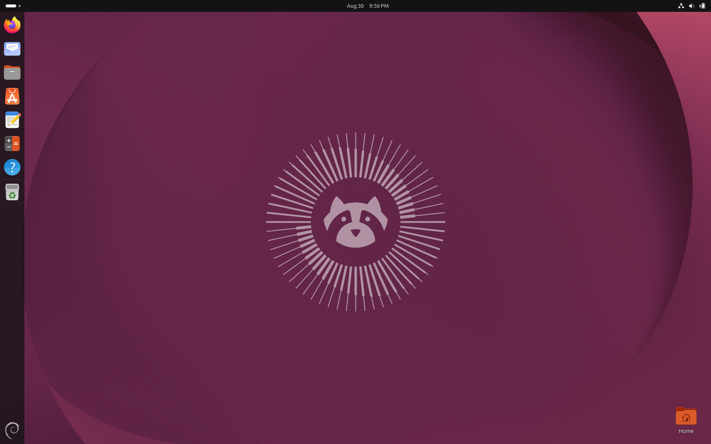
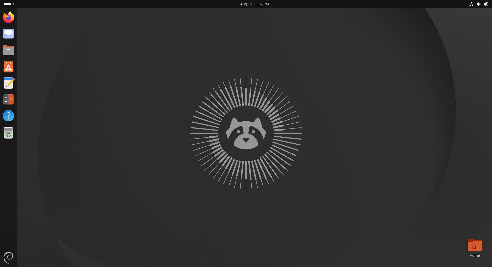
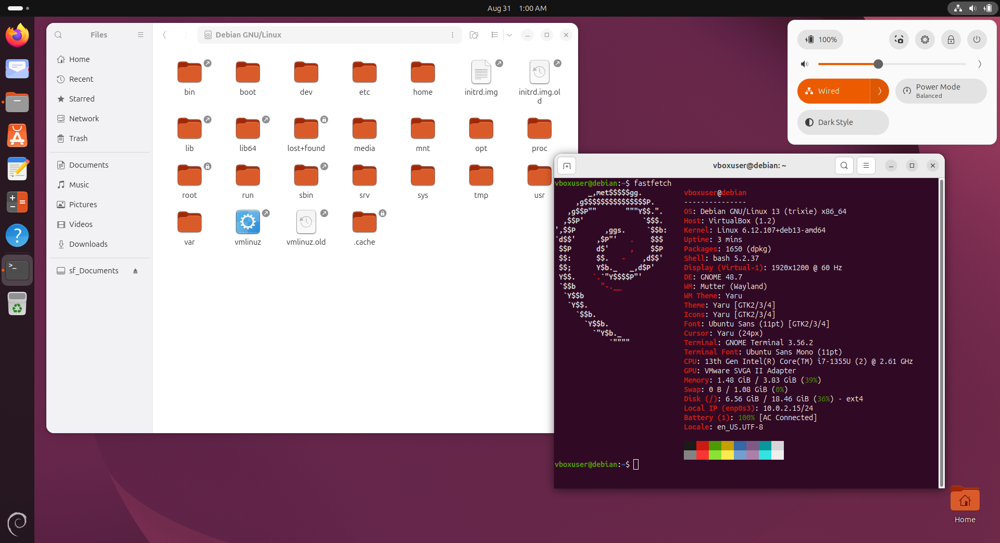
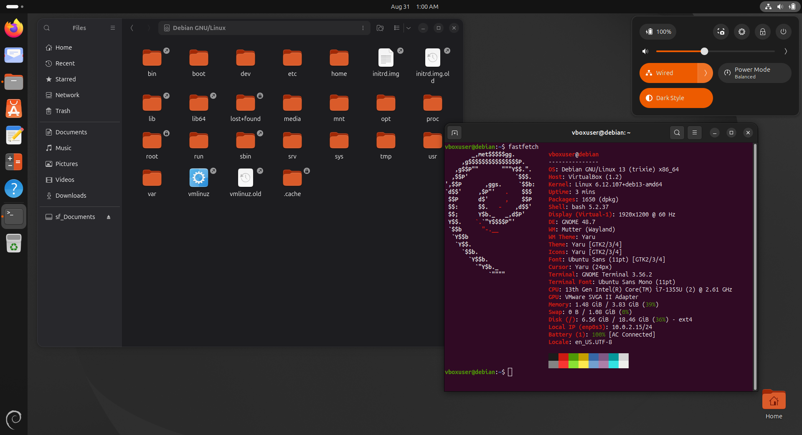

# ubuntu-look

Transform a fresh Debian GNOME desktop into an authentic Ubuntu look.

`ubuntu-look.sh` installs the genuine **Yaru** theme, **Ubuntu fonts**, the full official
**wallpaper collection** of the current release, **ubuntu-dock**, the tiling-assistant and
app-indicator extensions, and Ubuntu's **terminal colours**, then applies all
Ubuntu GNOME defaults — including enabling the extensions — via a dconf system profile.
It also gives the software store Ubuntu's **App Center** icon in place of the GNOME one.

Visuals only: no extra applications, no Snap/Flatpak/AppImage, and your dock favourites are
left exactly as they are — Ubuntu pins no terminal there either. Nothing outside the
theming is touched.

Unlike the original, everything takes effect on the **first run** — there is no need to
reboot and re-run the script.

Yaru, Ubuntu Sans, the release wallpaper, ubuntu-dock and Ubuntu's terminal colours, on Debian.
Your light/dark choice is never overwritten — the shell theme follows whichever you set.

| Light | Dark |
| :---: | :---: |
|  |  |
|  |  |

## Always the latest Ubuntu, on whatever Debian you run

No release name is baked into the script — neither Debian's nor Ubuntu's:

- The Ubuntu releases to consider are read from the archive's own `dists/` index on **every
  run**, and ordered by each release's `Version:` field. A brand-new Ubuntu becomes a
  candidate the day it is published; the script never needs editing to keep up. (Debian's
  `distro-info-data` is deliberately not used — on a stable Debian it is frozen at Debian's
  release date, so it never learns about the newer Ubuntu releases we are after.)
- A release **still in development is left out**, because it always carries the higher
  version number and would otherwise silently win — you would get a pre-release Yaru that
  changes daily. The archive itself says which one that is: a released suite's `Release`
  file is written once and never carries `Valid-Until`, while the development suite is
  rebuilt continuously and always does. So the exclusion lifts **on release day**, with no
  action from you and no edit here.
- The wallpaper and the icon/GTK/sound themes **float to the newest version** across the
  remaining releases — i.e. the latest released Ubuntu.
- The GNOME Shell theme and the dock/appindicator extensions are tied to a `gnome-shell`
  major version, so they pin to the newest Ubuntu release that a **simulated install proves
  compatible** with the GNOME Shell you are actually running.
- Debian's side is simply whatever suite the machine already runs.
- If Ubuntu ever rotates its archive signing key, the script fetches the new one
  automatically instead of failing with `NO_PUBKEY`.
- **A retired Ubuntu release will not break `apt update`.** At end of life a release
  moves from `archive.ubuntu.com` to `old-releases.ubuntu.com`, and apt fails the *entire*
  update run on one `404` — which would stop Debian's own security updates arriving. Each
  suite is probed before it is written and the source names whichever host serves it. A
  release that has moved is rewritten on the next run.

### Keeping it current

Between runs, an ordinary `sudo apt upgrade` carries the wallpapers, the Yaru GTK /
icon / sound themes and the Ubuntu fonts forward on their own: they are pinned without
a codename, so they float to the newest version across the Ubuntu releases already
configured and their `-updates` suites. Debian's `unattended-upgrades` allows only
Debian origins by default, so it will not do this in the background for you.

Re-run the script when a new Ubuntu is published. The archive is read fresh on every
run, so the release becomes a candidate the day it appears; the sources and pin are
rewritten to match, and **anything already installed is carried up to the new release
too** — being present is not treated as being current. Re-runs are otherwise cheap: a
file whose content has not changed is not written, and the SUMMARY says what was
already current.

> A cross-release upgrade usually has to pull in a package that is not installed yet —
> `ubuntu-wallpapers` depends on a per-release pack, for instance — and `apt-get upgrade`
> will not do that on its own. It keeps such a package back, silently. That is why the
> script upgrades its own packages by name rather than leaving them to the system
> upgrade.

The script **does not upgrade the rest of your system**. Debian's
[Don't break Debian](https://wiki.debian.org/DontBreakDebian) names a blanket
`apt-get upgrade` as the hazard of a configured foreign archive, since it takes every
installed package to the highest version any source offers. Ordinary system updates stay
yours to run; `UBUNTU_LOOK_SYSTEM_UPGRADE=1` restores the old behaviour.

Two parts move at different speeds, by necessity:

| | tracks |
|---|---|
| Wallpapers, Yaru GTK / icon / sound themes, Ubuntu fonts | the newest of the configured Ubuntu releases |
| GNOME Shell theme, ubuntu-dock, tiling-assistant, appindicator | the newest Ubuntu your Debian's GNOME Shell can actually load |

The second row is a hard constraint, not a choice: those packages declare a dependency on
one specific `gnome-shell` major version. On Debian 13 (GNOME 48) that means Ubuntu 25.04's
build, and a newer Ubuntu's build would refuse to install.

**Nothing is ever forced, and nothing is given up on either.** When the newest build will
not go on, the script walks that package's versions down — never below what is already
installed, never above what the pin selected — and takes the newest one that does fit. A
build that could only be installed by removing something (a Yaru tied to the next
gnome-shell installs perfectly well, *by removing gnome-shell*) is refused outright. The
SUMMARY reports the outcome in its own section:

| section | meaning |
|---|---|
| `Upgraded this run` | carried forward to a newer build, old → new |
| `Already installed and current` | nothing newer on offer |
| `Kept at the last compatible build` | something newer exists, does not fit this Debian, and the reason apt gave |
| `Could not be installed on this system` | no build anywhere will install here |

### Upgrading Debian itself

**Before** a Debian release upgrade (13 → 14), run:

```bash
$ bash ubuntu-look.sh prepare-upgrade
```

It removes the Ubuntu apt source, the pin, and the three packages tied to the running
GNOME Shell (`gnome-shell-extension-ubuntu-dock`,
`gnome-shell-extension-ubuntu-tiling-assistant`, `yaru-theme-gnome-shell`). The Yaru GTK
and icon themes, fonts and wallpapers stay, so the desktop does not go bare. Then upgrade
Debian, reboot, and re-run the script to restore the look on the new GNOME Shell.

Measured on a simulated `trixie → forky` `full-upgrade`:

| starting state | packages apt removes |
|---|---|
| never ran ubuntu-look | 19 |
| ubuntu-look installed, not prepared | 21 |
| ubuntu-look installed, after `prepare-upgrade` | 19 — identical to a clean Debian |

Skipping it is not fatal: the upgrade still completes, with no errors and nothing held
back. The two extra removals are the dock and tiling extensions, which apt drops because
their `gnome-shell (<< 49~)` dependency cannot be met. `yaru-theme-gnome-shell` declares
no upper bound, so it is kept and styles the new Shell with the old Shell's CSS until the
script is re-run; a run that finds this reports it before the SUMMARY.

### When Ubuntu outruns your Debian

Only the newest four Ubuntu releases are configured as sources, and only their `main`
component, because each adds a `Packages` index to every `apt update`. Everything the
script installs is in `main`, and Ubuntu policy forbids `main` depending on `universe`, so
the dependency closure is there too; adding `universe` would cost roughly 500 MB of
indices per update.

Ubuntu ships twice a year and Debian stable stands still for about two, so the release
carrying the last compatible shell theme eventually drops out of that window while the
Debian under it has not changed.

When that happens a run says so and reaches further back on its own — up to six more
published releases — adds the one that does have a compatible theme, and keeps just that
suite alongside the window. The cost is paid only on that path; an ordinary run never
looks past the four. If nothing anywhere fits, the run continues, installs everything that
does not depend on `gnome-shell`, and names the rest in the SUMMARY.

## Usage

Run as a normal user (**not** root) who is in the `sudo` group:

```bash
$ chmod +x ubuntu-look.sh
$ ./ubuntu-look.sh
# or:
$ bash ubuntu-look.sh
```

Confirm with `y` when prompted, enter your sudo password when asked, and follow the SUMMARY
instructions shown at the end (log out / reboot as needed). Re-runs are safe — already
installed packages and settings already in place are skipped automatically.

### Run a single stage

```bash
$ bash ubuntu-look.sh 2-desktop-gnome
# valid stages: 0-base  1-desktop-base  2-desktop-gnome
```

### Before upgrading Debian

Run `bash ubuntu-look.sh prepare-upgrade` first — see
[Upgrading Debian itself](#upgrading-debian-itself).

### Overrides

```bash
# Force one specific Ubuntu release (checked against the archive before use):
$ UBUNTU_CODENAME=questing bash ubuntu-look.sh

# Adopt the next Ubuntu before it is released (pre-release Yaru, changes daily):
$ UBUNTU_INCLUDE_DEVEL=1 bash ubuntu-look.sh

# Also upgrade the whole system, as older versions did (off by default):
$ UBUNTU_LOOK_SYSTEM_UPGRADE=1 bash ubuntu-look.sh

# Leave the boot splash out, or take back one already applied:
$ UBUNTU_BOOT_SPLASH=0 bash ubuntu-look.sh
```

## What it touches

The only existing system file it edits is `/etc/dconf/profile/user`, one line,
and it removes no packages at all. Everything else it owns outright — the Ubuntu
apt source, pin and keyring, and the dconf profile — and `uninstall.sh` takes it
all back out. An earlier version did remove one package of Debian's; whatever
that is on record as having taken out is installed again.

Two settings are yours and are never written: the light/dark choice and your
dock favourites. The script reads the first — it needs to know which Yaru shell
variant to name — and reads neither to decide anything else. Install in dark
mode and it stays dark, with the dark wallpaper and the dark shell theme;
uninstall leaves the choice exactly where you left it.

It writes no GTK config of its own. Ubuntu writes none either: the look comes
from the Yaru theme and the accent-color key, so anything an earlier version of
this script left in `gtk.css` or `.gtkrc-2.0` is removed and your own file
restored.

The one thing it does leave running is a follower for the shell theme, because
Yaru ships Yaru and Yaru-dark as two themes rather than one that follows the
colour scheme, and the `user-theme` extension resolves a name to exactly one
stylesheet, with no dark variant and no notion of the scheme. Ubuntu needs no
equivalent: its session mode names a theme resource carrying both, and its
shell picks between them itself.

It waits on the setting rather than polling it, so it is not run at all between
switches, and it writes only when the name is wrong. A theme you chose for
yourself is left alone: it moves between Yaru and Yaru-dark and touches no other
name. `uninstall.sh` takes it away.

Switching light and dark by hand does restyle the shell twice — once for the
scheme, once for the theme name — which shows as a flicker in the dock. Running
the decision in process, to close the gap between the two, was tried and
measured: the flicker was unchanged, so the simpler script is what is kept.
Logging in does not flicker, because the theme is already the right one.

**The bootloader is the one thing here that changes how the machine boots**, so it
is written to be taken back. Like Ubuntu, the installer puts `quiet splash` on the
kernel command line and installs Plymouth; `UBUNTU_BOOT_SPLASH=0 bash ubuntu-look.sh`
removes it again without a full uninstall.

Both directions are surgical. `quiet splash` is *added* to whatever is already on
your command line, never substituted for it: whichever of the two words is missing
gets appended, everything else stays where it was, and parameters your machine
depends on (`nomodeset`, `resume=`, iommu flags, a serial console) survive. The words
actually added are recorded, so the reverse pass removes exactly those and nothing
else — anything you put there yourself, before or after, is left alone, as is the rest
of `/etc/default/grub`. A system that does not boot with GRUB is skipped rather than
written to.

The boot splash theme becomes `bgrt`, which is Ubuntu's own default and which Debian
ships too: a black background, the firmware's logo where the firmware supplies one and
the distribution's where it does not, and a spinner below. No Ubuntu artwork is drawn —
on Debian the images come from Debian's `spinner` theme, so the boot screen keeps
Debian's branding, and Ubuntu's `plymouth-theme-ubuntu-text` is not pulled in.

The theme in force is recorded first, and `uninstall.sh` puts it back. A theme you
choose for yourself afterwards is left alone: the record says the theme in use is no
longer this script's, so a later run does not overrule it. `PLYMOUTH_THEME=<name>`
picks a different one, and `sudo plymouth-set-default-theme -R <name>` is always yours
to run.

Applying or removing the splash rebuilds the initramfs and needs a reboot; nothing
else in the script does, and a log out and back in covers the rest. You can also
change the line by hand at any time — edit `/etc/default/grub` and run `sudo
update-grub` — or drop `splash` for a single boot from the GRUB menu with `e`. A word
you take off stays off: the installer records which words it added, and a later run does
not put back one that is no longer there.

The terminal keeps Ubuntu's colours rather than Ubuntu's terminal. Ubuntu and
Debian ship different terminal applications, and swapping one for the other
reaches well past the look of the desktop; the palette is what is actually seen.
So the installer adds a gnome-terminal profile named Ubuntu, with Ubuntu's own
colours, and makes it the default. Profiles you already have are untouched:
this one is appended to the list, and `uninstall.sh` removes only it, leaving
the default to whichever profile gnome-terminal picks for itself.

The login screen is themed too. The greeter runs as its own user and reads the gdm
dconf profile, so a database file under `/etc/dconf/db/gdm.d/` gives it the Yaru
theme, the Yaru cursor, Ubuntu's fonts and the same wallpaper the desktop uses — the
greeter block Ubuntu ships, key for key. Ubuntu's gdm ships that profile and Debian's
does not, so it is created when missing and recorded; `uninstall.sh` removes the
database file always and the profile only where this script created it.

The one key left out is `logo`, which Ubuntu points at its own artwork: no branding is
put on the screen. Choose one yourself in a file of your own under
`/etc/dconf/db/gdm.d/` and it stays there. What cannot be changed is the greeter's own
blue: GNOME Shell draws the login dialog from the stylesheet compiled into
`gnome-shell-theme.gresource`, which is Debian's file and is not overwritten here.

The Show Applications button carries the distribution's logo. The dock asks for
that icon as `view-app-grid-<session mode>-symbolic`; Ubuntu's session mode is
`ubuntu` and Yaru ships `view-app-grid-ubuntu-symbolic`, which is why the button
wears the Ubuntu logo there. A Debian session's mode is `user` and no icon of
that name exists, so the generic grid is drawn. Supplying that one name from the
Debian logo in `desktop-base` puts this distribution's mark in the same place —
nothing is overridden, because Yaru never defines it. The copy's `viewBox` is
widened first so the artwork covers the same share of the canvas as Ubuntu's
does and the button matches the weight of the icons beside it.

The desktop icons come from Ubuntu's own build of the extension. The selection
rectangle you drag across the desktop takes its colour from there: Debian's
build reads the theme's selected background, which under Yaru is orange, while
Ubuntu's reads the normal text colour, which is why it is grey on Ubuntu. It is
the same extension at two versions.

Ubuntu ships its build inside `gnome-shell-ubuntu-extensions`, which cannot be
installed here — it depends on gnome-shell 49 and conflicts with the four
extension packages this script installs. Only the desktop-icons part is
unpacked out of it, into `~/.local/share/gnome-shell/extensions/`, where
gnome-shell prefers it over the system copy; its settings schema goes to
`~/.local/share/glib-2.0/schemas/` for the same reason. Debian's package stays
installed and untouched, so removing the directory hands the desktop straight
back to it, which is what `uninstall.sh` does. The extension names the
gnome-shell versions it supports and is only put in place when the running one
is among them; a directory that was already there before the install is left
alone.


## Tweaking the result

Everything the script applies is an ordinary GSettings key. Each command below
is complete — copy the line, change the value at the end. `(script: X)` is what
the installer writes, so a later run overwrites your choice on that key; keys
without it are left alone. `uninstall.sh` restores them all.

```bash
$ gsettings get   org.gnome.desktop.interface accent-color   # read a key
$ gsettings reset org.gnome.desktop.interface accent-color   # undo one key
```

### Dock

Ubuntu Dock is a dash-to-dock fork and answers to its schema.

```bash
# Position: LEFT RIGHT BOTTOM TOP  (script: LEFT)
$ gsettings set org.gnome.shell.extensions.dash-to-dock dock-position BOTTOM

# Span the whole edge, or a centred panel  (script: true)
$ gsettings set org.gnome.shell.extensions.dash-to-dock extend-height false

# Always visible  (script: true)
$ gsettings set org.gnome.shell.extensions.dash-to-dock dock-fixed false

# Hide under windows
$ gsettings set org.gnome.shell.extensions.dash-to-dock intellihide true

# What hides it: ALL_WINDOWS FOCUS_APPLICATION_WINDOWS MAXIMIZED_WINDOWS ALWAYS_ON_TOP  (script: ALL_WINDOWS)
$ gsettings set org.gnome.shell.extensions.dash-to-dock intellihide-mode MAXIMIZED_WINDOWS

# Icon size in pixels
$ gsettings set org.gnome.shell.extensions.dash-to-dock dash-max-icon-size 32

# Click a running app: minimize cycle-windows previews launch quit focus-or-appspread  (script: focus-or-appspread)
$ gsettings set org.gnome.shell.extensions.dash-to-dock click-action minimize

# Scroll over the dock: do-nothing switch-workspace cycle-windows  (script: switch-workspace)
$ gsettings set org.gnome.shell.extensions.dash-to-dock scroll-action cycle-windows

# Running-app marker: DOTS DASHES SQUARES SEGMENTED SOLID METRO CILIORA BINARY  (script: DOTS)
$ gsettings set org.gnome.shell.extensions.dash-to-dock running-indicator-style DASHES

# Log in to the desktop instead of the overview  (script: true)
$ gsettings set org.gnome.shell.extensions.dash-to-dock disable-overview-on-startup false
```

**Trash and drives on the dock:**

```bash
# Trash entry
$ gsettings set org.gnome.shell.extensions.dash-to-dock show-trash false

# Drive entries
$ gsettings set org.gnome.shell.extensions.dash-to-dock show-mounts false

# List only drives that are mounted right now  (script: false, i.e. list them all)
$ gsettings set org.gnome.shell.extensions.dash-to-dock show-mounts-only-mounted true

# Include network shares  (script: true)
$ gsettings set org.gnome.shell.extensions.dash-to-dock show-mounts-network false
```

**Transparency.** Ubuntu ships `DEFAULT`: translucent over the desktop, solid
once a window touches the dock. Opacities are fractions — `0.25` is 25% opaque
(very see-through), `0.8` is nearly solid.

```bash
# One opacity that never changes
$ gsettings set org.gnome.shell.extensions.dash-to-dock transparency-mode FIXED
$ gsettings set org.gnome.shell.extensions.dash-to-dock background-opacity 0.25

# Two-state, your own ends: desktop clear, then a window against the dock
$ gsettings set org.gnome.shell.extensions.dash-to-dock transparency-mode DYNAMIC
$ gsettings set org.gnome.shell.extensions.dash-to-dock customize-alphas true
$ gsettings set org.gnome.shell.extensions.dash-to-dock min-alpha 0.1
$ gsettings set org.gnome.shell.extensions.dash-to-dock max-alpha 0.9

# Back to Ubuntu's behaviour
$ gsettings reset org.gnome.shell.extensions.dash-to-dock transparency-mode
```

**Timings**, in seconds. These do nothing until the dock hides — set
`dock-fixed false` or `intellihide true` above first.

```bash
# Slide in / out, and the pauses before each
$ gsettings set org.gnome.shell.extensions.dash-to-dock animation-time 0.0
$ gsettings set org.gnome.shell.extensions.dash-to-dock show-delay 0.0
$ gsettings set org.gnome.shell.extensions.dash-to-dock hide-delay 0.0

# Push the screen edge to reveal it, and how hard
$ gsettings set org.gnome.shell.extensions.dash-to-dock require-pressure-to-show false
$ gsettings set org.gnome.shell.extensions.dash-to-dock pressure-threshold 100.0
```

### Desktop icons

Icons come from `~/Desktop`; there is no key for showing a folder elsewhere —
symlink it in.

```bash
# Corner they start from: top-left top-right bottom-left bottom-right  (script: bottom-right)
$ gsettings set org.gnome.shell.extensions.ding start-corner top-left

# Trash on the desktop  (script: false)
$ gsettings set org.gnome.shell.extensions.ding show-trash true

# Mounted drives on the desktop  (script: false)
$ gsettings set org.gnome.shell.extensions.ding show-volumes true

# Sort order: NAME DESCENDINGNAME MODIFIEDTIME KIND SIZE  (script: DESCENDINGNAME)
$ gsettings set org.gnome.shell.extensions.ding arrangeorder NAME
```

### Appearance

```bash
# Light / dark. The shell theme follows on its own.
$ gsettings set org.gnome.desktop.interface color-scheme prefer-dark

# Accent: blue teal green yellow orange red pink purple slate  (script: orange)
$ gsettings set org.gnome.desktop.interface accent-color purple

# Wallpaper — set both keys, or the dark theme keeps the old one
$ gsettings set org.gnome.desktop.background picture-uri      'file:///usr/share/backgrounds/warty-final-ubuntu.png'
$ gsettings set org.gnome.desktop.background picture-uri-dark 'file:///usr/share/backgrounds/warty-final-ubuntu.png'

# Window buttons on the left  (script: ':minimize,maximize,close')
$ gsettings set org.gnome.desktop.wm.preferences button-layout 'close,minimize,maximize:'
```

### Behaviour

```bash
# Clock: 24h is the default on both, so the script leaves it alone
$ gsettings set org.gnome.desktop.interface clock-format 12h

# Middle-click paste  (script: false)
$ gsettings set org.gnome.desktop.interface gtk-enable-primary-paste true

# Top-left corner opens the overview: Debian's default, off under Ubuntu  (script: false)
$ gsettings set org.gnome.desktop.interface enable-hot-corners true

# What the Super key does. '' unbinds it; `gsettings get` first to note the current one.
$ gsettings set org.gnome.mutter overlay-key ''

# Edge tiling: on by default on both, and the tiling assistant builds on it
$ gsettings set org.gnome.mutter edge-tiling false
```

### Animations

```bash
# Master switch: every GNOME and GTK animation, applications included
$ gsettings set org.gnome.desktop.interface enable-animations false

# Tiling assistant: into a tile, out of one, and the half-screen popup
$ gsettings set org.gnome.shell.extensions.tiling-assistant enable-tile-animations false
$ gsettings set org.gnome.shell.extensions.tiling-assistant enable-untile-animations false
$ gsettings set org.gnome.shell.extensions.tiling-assistant enable-tiling-popup false
```

The dock's own slide follows the master switch, or its timings above.

The login screen is a different user, so this does not quiet the greeter. Put
`enable-animations=false` under `[org/gnome/desktop/interface]` in a file of
your own in `/etc/dconf/db/gdm.d/`, then `sudo dconf update`. It stays there:
`uninstall.sh` removes only the database file this script wrote.

### A settings window instead

**Extension Manager** (`gnome-shell-extension-manager`) gives Ubuntu Dock a
settings button. Ubuntu does not ship it, so neither does this — install it
yourself. GNOME Settings has no dock panel on Debian; that panel comes from
Ubuntu's patched `gnome-control-center`.

## Offline install

`ubuntu-look-offline.sh` does the same job from a local `.deb` bundle in `packages/`.

```bash
# Refresh the bundle if the archive is reachable, then install from it:
$ bash ubuntu-look-offline.sh

# Install without going near the network, even where there is one:
$ bash ubuntu-look-offline.sh --no-refresh

# Refresh the bundle and stop, to carry packages/ to another machine:
$ bash ubuntu-look-offline.sh --download
```

Refreshing the bundle is the only thing here that uses the network. It checks what
`packages/` already holds, leaves anything current alone, fetches what is missing or newer,
prunes superseded `.deb`s, and removes any package that has dropped out of the set — and a
`.deb` is only replaced once its successor is provably on disk, so an interrupted refresh never
leaves the bundle worse than it found it.
The install that follows reads nothing but `packages/`: no package, key or index comes off
the network, so the result is identical whether the refresh ran or not.

On a machine with no route to the archive the check fails in seconds and the bundle is used
exactly as it stands — the case this script exists for. `--no-refresh` forces the same where
there is a connection. It honours the same `UBUNTU_INCLUDE_DEVEL` override.

A refresh updates the `packages/` beside the script it ran from, and no other copy. Refresh
the one you intend to carry, and check `packages/BUNDLE_INFO` for the date it was last built.

## Logs

Every run records itself. The terminal keeps its colours while a colour-stripped copy is
written to `$HOME/<script>-<date>.log`. Each log opens with the system, kernel, GNOME Shell,
window manager and session it ran on, and with the two Ubuntu releases in play: the one the
shell theme is pinned to, and the one the rest of the theme floats to. It closes with the
resulting package versions, pin, extension states, terminal selection and theme, so a run can
be diagnosed from the file alone. `UBUNTU_LOOK_LOG=0` disables it.

```bash
$ bash ubuntu-look.sh            # ubuntu-look-<date>.log
$ bash ubuntu-look-offline.sh    # ubuntu-look-offline-<date>.log
$ bash uninstall.sh              # uninstall-<date>.log
```

## Uninstall

```bash
$ bash uninstall.sh
```

On its first run, either install script snapshots your pre-existing configuration to
`~/.ubuntu-look-backup/` and records exactly which packages it installed — the dependencies apt
brought in alongside them included — so `uninstall.sh` restores what was there before rather than
guessing. Without a snapshot (e.g. an install that predates the backup feature) it falls back to
best-effort detection and says so at every step where it is guessing. With no record at all —
the installer never ran here, or an earlier uninstall already finished and took its records
with it — no package is removed, because there is nothing left to check a candidate against.

Nothing that was already on the system when the installer first ran is ever removed. The
snapshot holds the complete package list from that moment, and every removal candidate is
checked against it — so a yaru theme, or anything else you installed yourself
beforehand stays exactly where it is, as does everything your Debian shipped with. The
same goes for what you install afterwards: only the packages the installer actually added
are taken back out, and a key it changed goes back to the value it had before, not to
Ubuntu's. Dock favourites go back to what the snapshot recorded before the
first install, and the terminal profile this script added is removed while every
profile you made keeps its place. The backup directory is deleted at the end,
unless a step could not finish and the snapshot is the only way to retry it.

## Tests

The package-resolution logic — which Ubuntu release gets pinned, what is
installed, what is carried forward when a new Ubuntu appears, and what is left
alone when it will not fit — has an integration suite under `tests/`:

```bash
$ bash tests/run-all.sh
```

It builds real `.deb` packages and a real GPG-signed archive in `$TMPDIR`, then
runs the scripts' own functions against a real apt resolver and a real dpkg
database. Nothing is mocked and nothing outside `$TMPDIR` is touched — it needs
no root and does not look at the machine it runs on.

`bash tests/mutate.sh` breaks each behaviour on purpose and requires the suite
to notice. See `tests/README.md`.

## Requirements

- Debian with the GNOME desktop — the current stable is what this targets
- The executing user must be in the `sudo` group (the script advises you how if not)
- A working internet connection (not needed by `ubuntu-look-offline.sh`)

## Credits

This is a reworked version of **make-debian-look-like-ubuntu** by **DeltaLima**.

- Original: https://github.com/DeltaLima/make-debian-look-like-ubuntu
- Upstream source: https://git.la10cy.net/DeltaLima/make-debian-look-like-ubuntu

For older Debian releases, check out the upstream
[tags](https://git.la10cy.net/DeltaLima/make-debian-look-like-ubuntu/tags).
