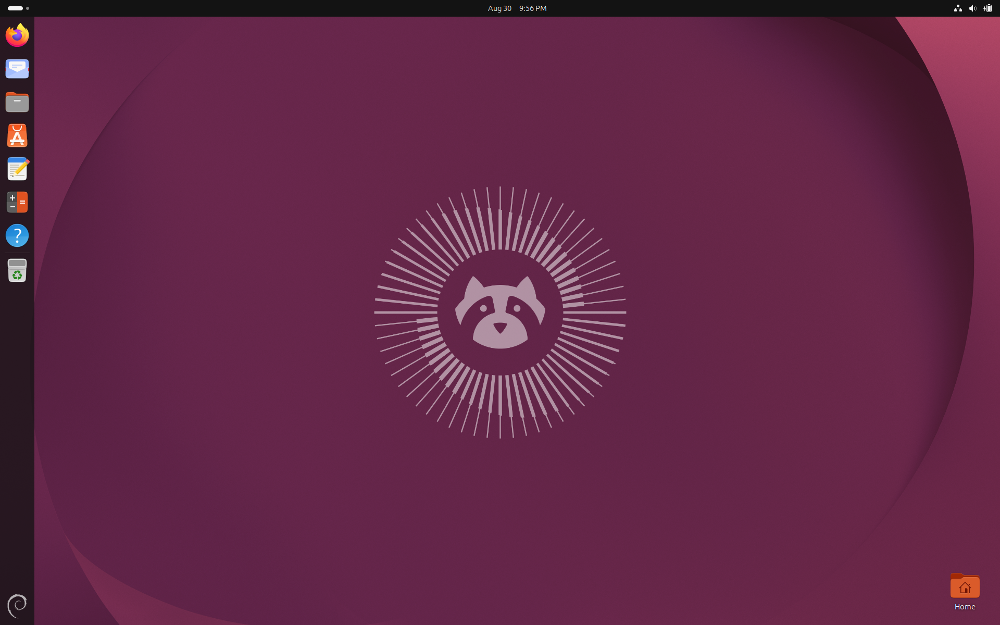
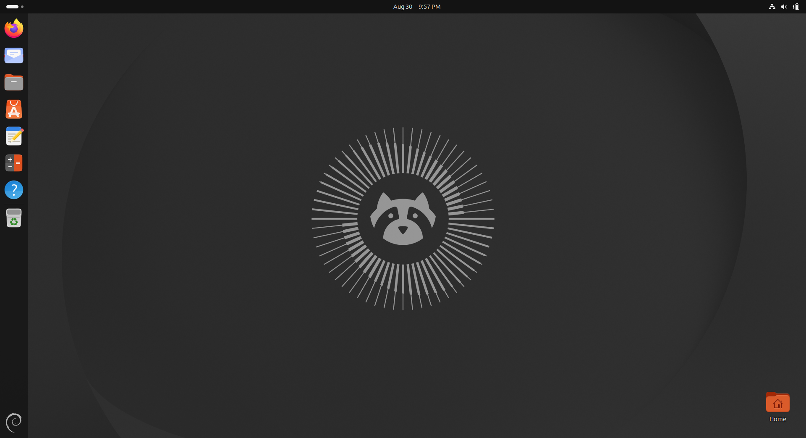
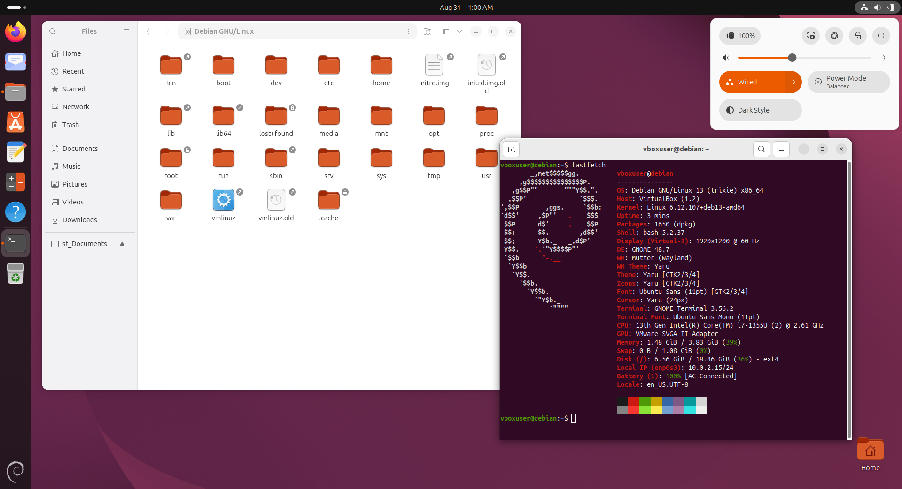
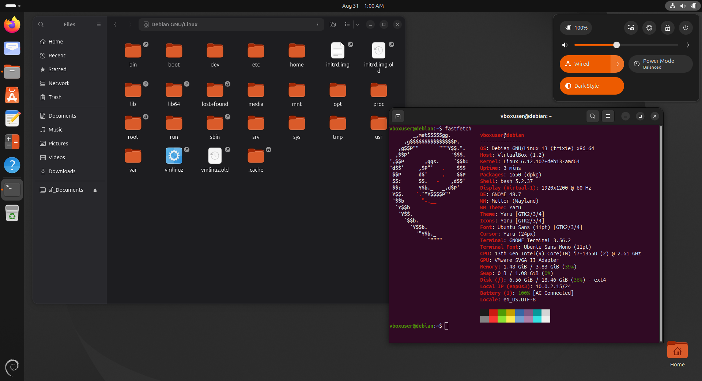

# ubuntu-look

Makes Debian GNOME look and behave like the newest Ubuntu release that
works with your GNOME Shell (the desktop itself), without breaking Debian.
It brings Yaru themes, Ubuntu fonts and wallpapers, Ubuntu Dock, the tiling
assistant, tray icons, desktop icons, Ubuntu's terminal colours, a Yaru
login screen, Ubuntu's boot splash and Ubuntu's desktop settings. No
applications are installed.

The script finds that release each time it runs. For example, Debian 13
with GNOME 48 gets Ubuntu 25.04.

Where it differs from Ubuntu:

- Ubuntu's own builds of GNOME Shell and Settings do not install on
  Debian. The Ubuntu Desktop page in Settings is therefore missing; the
  dock has its own settings window (see
  [Changing a setting](#changing-a-setting)). A few shades also differ,
  as Ubuntu's patched libadwaita and GNOME Shell use Yaru's exact accent
  shades. A small extension reproduces Ubuntu's dark style switch and
  accent themes.
- Left out on purpose: the Ubuntu logo on the login screen, Ubuntu's
  session name, and Canonical's web search and key server defaults.
- The boot menu is not hidden. Ubuntu hides it; on Debian that could
  leave a failed boot without a menu.






## Quick start

1. Download `ubuntu-look.sh` (or clone this repository).
2. Open a terminal in its folder, inside your desktop session, and run:

   ```bash
   bash ubuntu-look.sh
   ```

3. Read what it will do, type `y` and press Enter, then enter your
   password when asked. The script asks at the terminal, so answers piped
   into it (`yes | bash ubuntu-look.sh`) are not used; without a terminal
   every question counts as no.
4. At the end, reboot (or log out and back in, if the script says that
   is enough).

Running it again is safe. To undo it, see [Uninstall](#uninstall).

## Requirements

- Debian with GNOME, on a processor type Ubuntu supports (amd64, arm64
  and others).
- A normal user account with sudo rights (administrator rights). Do not
  run it as root.
- Internet access, except for an [offline install](#offline-install).
- GNOME Shell 45 or later for the Yaru shell theme, style switching and
  the Yaru login screen; 47 or later for the accent colour.

## Usage

```bash
bash ubuntu-look.sh                   # install or update
bash ubuntu-look.sh --refresh         # list updates, then ask
bash ubuntu-look.sh --uninstall       # undo the look
bash ubuntu-look.sh --prepare-upgrade # before a Debian upgrade
bash ubuntu-look.sh --download        # fill packages/ (offline)
bash ubuntu-look.sh --offline         # install from packages/
bash ubuntu-look.sh --help            # commands and options
```

Run the script from your desktop session. The look applies to the user who
runs it; other users keep Debian's look until they run it themselves. The
login screen and the boot splash are shared by all users.

## Options

Options are settings placed in front of the command, for example:

```bash
UBUNTU_BOOT_SPLASH=0 bash ubuntu-look.sh
```

Several can be given at once, separated by spaces.

### Remembered options

The script remembers these five and uses them again on later runs until
you give a new value. An offline install remembers only the two boot
splash options.

- **`UBUNTU_CODENAME`**: use a specific Ubuntu release, named by its code
  name. Default: `auto`, the newest release that fits your GNOME Shell.

  ```bash
  UBUNTU_CODENAME=noble bash ubuntu-look.sh
  UBUNTU_CODENAME=auto bash ubuntu-look.sh   # back to automatic
  ```

  A release made for another GNOME Shell may leave out the dock or the
  shell theme; the summary says which. `devel` is not accepted; use
  `UBUNTU_INCLUDE_DEVEL=1` instead.

- **`UBUNTU_INCLUDE_DEVEL`**: `1` also considers the Ubuntu release still
  in development; `0` does not. Default: `0`, released versions only.

  ```bash
  UBUNTU_INCLUDE_DEVEL=1 bash ubuntu-look.sh
  ```

- **`UBUNTU_MIRROR`**: download the Ubuntu packages from another server,
  given as one `http://` or `https://` address. Default:
  `http://archive.ubuntu.com/ubuntu` on amd64 and i386,
  `http://ports.ubuntu.com/ubuntu-ports` on other processor types.

  ```bash
  UBUNTU_MIRROR=http://de.archive.ubuntu.com/ubuntu \
    bash ubuntu-look.sh
  ```

- **`UBUNTU_BOOT_SPLASH`**: `1` adds the boot splash (the logo shown
  while the computer starts); `0` leaves it out and removes one added
  earlier. Default: `1`.

  ```bash
  UBUNTU_BOOT_SPLASH=0 bash ubuntu-look.sh
  ```

- **`PLYMOUTH_THEME`**: the boot splash theme. Default: `bgrt`, Ubuntu's
  splash with the computer maker's logo. To list the installed themes:
  `/usr/sbin/plymouth-set-default-theme -l`.

  ```bash
  PLYMOUTH_THEME=spinner bash ubuntu-look.sh
  ```

### One-run options

These apply only to the run they are given to.

- **`UBUNTU_LOOK_ANIMATIONS`**: `0` turns animation effects off, `1` turns
  them on. Default: not set; animations stay as they are. See
  [Animations](#animations).

- **`UBUNTU_LOOK_SYSTEM_UPGRADE`**: `1` also upgrades the rest of the
  system, as `apt upgrade` does. Default: off; only the look's packages
  are upgraded.

  ```bash
  UBUNTU_LOOK_SYSTEM_UPGRADE=1 bash ubuntu-look.sh
  ```

- **`UBUNTU_LOOK_FORCE_BUNDLE`**: `1` lets `--offline` accept packages
  downloaded on a different Debian release or GNOME Shell version.
  Default: off; such packages are refused.

  ```bash
  UBUNTU_LOOK_FORCE_BUNDLE=1 bash ubuntu-look.sh --offline
  ```

- **`UBUNTU_LOOK_LOG`**: `0` writes no log file. Default: a log in your
  home folder.

  ```bash
  UBUNTU_LOOK_LOG=0 bash ubuntu-look.sh
  ```

## Animations

Animation effects are on by default in both Ubuntu and Debian, and the
look does not change that. They cover:

- opening, closing, minimising and maximising windows;
- switching workspaces;
- the Activities overview and the app grid;
- Ubuntu Dock showing, hiding and its icon effects;
- the tiling assistant's tile and untile movement;
- transitions inside GTK apps.

One setting turns all of them off or on. It is the same switch as
Settings → Accessibility → Seeing → Reduce Animation.

```bash
UBUNTU_LOOK_ANIMATIONS=0 bash ubuntu-look.sh   # off
UBUNTU_LOOK_ANIMATIONS=1 bash ubuntu-look.sh   # on
```

The option also works with the uninstall:

```bash
UBUNTU_LOOK_ANIMATIONS=0 bash ubuntu-look.sh --uninstall
```

It applies to your user only. Without the option nothing is changed:
later runs and the uninstall keep your choice.

## What changes

### Packages

From the chosen Ubuntu release:

- **Yaru themes** for apps, icons, sounds and the desktop shell
  (`yaru-theme-gtk`, `yaru-theme-icon`, `yaru-theme-sound`,
  `yaru-theme-gnome-shell`), with `humanity-icon-theme`, which Yaru
  builds on.
- **Fonts:** `fonts-ubuntu`.
- **Wallpapers:** `ubuntu-wallpapers` and the release's own set.
- **Ubuntu Dock:** `gnome-shell-extension-ubuntu-dock`.
- **Window tiling:** `gnome-shell-extension-ubuntu-tiling-assistant`.
- **`session-migration`:** required by Yaru.
- **LibreOffice style:** `libreoffice-style-yaru`, only when LibreOffice
  is installed.

From Debian:

- **Tray icons in the top bar:** `gnome-shell-extension-appindicator`,
  with `gir1.2-dbusmenu-gtk3-0.4` for their menus.
- **Files and folders on the desktop:**
  `gnome-shell-extension-desktop-icons-ng`.
- **Login sound:** `gnome-session-canberra`, which plays Yaru's login
  sound, as on Ubuntu.
- **Boot splash:** `plymouth` and `plymouth-themes`.
- **Settings tool:** `dconf-cli`.
- **Ubuntu's signing keys:** `ubuntu-keyring`, which apt uses to check
  the Ubuntu packages.
- **Download tools:** `curl` and `ca-certificates`, if missing. The
  uninstall keeps them.

Some Ubuntu releases ship Ubuntu Dock, the tiling assistant, tray icons and
desktop icons as one package, `gnome-shell-ubuntu-extensions`. When the
chosen release has it, the script installs it instead of the four
separate packages. When the package carries Ubuntu's web search provider
extension, that is switched on too, as on Ubuntu. The uninstall puts back
the Debian packages it replaced.

### Desktop

- **Settings:** Ubuntu's desktop settings, listed below. The first
  install replaces your theme, style, wallpaper, fonts, dock and similar
  settings with Ubuntu's; your dock favourites stay. Settings you change
  afterwards are kept by later runs.
- **Dock:** if Dash-to-Dock is on, it is turned off for you; Ubuntu Dock
  takes its place.
- **Terminal:** a gnome-terminal profile named Ubuntu, with Yaru's
  #300A24 background and GNOME's standard colours, as on Ubuntu. It
  becomes the default when it is new or no default is set.
- **Ctrl+Alt+T:** opens the terminal, as on Ubuntu. It is added to your
  own keyboard shortcuts unless one of your custom shortcuts already
  uses it; if you remove it, it stays removed.
- **Font smoothing:** subpixel in all apps, as Ubuntu's font settings
  do, through a small rule in your own font settings.
- **Show Applications button:** shows the Debian logo in Ubuntu Dock.
- **Shell icons:** the top bar and menus use Yaru's own symbolic icons,
  as on Ubuntu.
- **Accent colour:** as on Ubuntu, choosing an accent colour in Settings
  switches the theme and icons to the matching Yaru colour.
- **Login screen:** Yaru theme and sounds, Ubuntu fonts and wallpaper.
- **Donation reminder:** off with GNOME 49 and later, as on Ubuntu.
- **Boot (with GRUB only):** `quiet splash` is added to the start-up
  options in `/etc/default/grub` where missing, and the boot splash theme
  is set. Other GRUB settings are not touched. Where a file in
  `/etc/default/grub.d/` sets the start-up options, `/etc/default/grub` is
  left alone and the summary says so. Without GRUB the boot is left alone.

### Ubuntu's settings compared with Debian's

Each line gives Ubuntu's value (the look), then Debian's.

Keyboard and windows:

- Alt+Tab: switches windows; Debian: switches apps.
- Super+Tab: switches apps; Debian: the same.
- Super+D (also Ctrl+Super+D, Ctrl+Alt+D): shows the desktop; Debian:
  nothing.
- Ctrl+Alt+T: opens the terminal; Debian: nothing.
- Window buttons: minimise, maximise, close on the right; Debian: close
  only.
- Middle-click on a title bar: lowers the window; Debian: nothing.
- Hot corner (top left): off; Debian: on.

Power:

- Power button: asks what to do; Debian: suspend.
- Sleep on mains power: never; Debian: after 15 minutes idle.
- Log Out in the system menu: always shown; Debian: with several users.

Touchpad and sound:

- Tap to click: on; Debian: on (off in older GNOME versions).
- Right click: by area or two fingers, as the touchpad supports; Debian:
  two fingers.
- Sound theme: Yaru; Debian: freedesktop.
- Sounds on input: on; Debian: off.

Appearance:

- Style: light; Debian: light.
- Accent colour: orange; Debian: blue.
- Theme, icons and cursor: Yaru; Debian: Adwaita.
- Interface font: Ubuntu Sans 11; Debian: Cantarell 11.
- Document font: Sans 11; Debian: Cantarell 11.
- Monospace font: Ubuntu Sans Mono 13, or 11 with GNOME 49 and later
  (as on Ubuntu 25.10 and later); Debian: Monospace 11.
- Window title font: Ubuntu Sans Bold 11; Debian: the interface font.
- Font smoothing: subpixel for all apps; Debian: greyscale.
- Terminal style: dark; Debian: follows the desktop style.
- Dock: Ubuntu Dock on the left, full height, always shown; Debian: none
  (the dash in the Activities overview).
- Desktop icons: shown, from the bottom right, without trash or drives;
  Debian: none.

Files and file dialogs:

- Icon size in Files: small; Debian: medium.
- Open a folder when dragging over it: off; Debian: on.
- Folders first in GTK 3 file dialogs: on; Debian: off.
- GTK 3 file dialogs start in: the current folder; Debian: recent files.

Apps (used once you install them):

- Image Viewer (eog): sidebar hidden; Debian: shown.
- Rhythmbox: watches the music library, uses the alternative toolbar
  (`rhythmbox-plugin-alternative-toolbar`); Debian: neither.
- Onboard keyboard: Nightshade theme, docked, kept on top, Ubuntu Sans
  labels; Debian: Classic Onboard theme, floating.
- Software: no forced metadata refresh on its first start; Debian:
  forced.

### Changing a setting

Most settings are in GNOME Settings. The others can be changed in a
terminal with `gsettings set`. To return to Ubuntu's value, use
`gsettings reset` with the same two names:

```bash
gsettings reset org.gnome.settings-daemon.plugins.power \
  power-button-action
```

Keyboard and windows:

```bash
# Alt+Tab switches apps, as on Debian
gsettings set org.gnome.desktop.wm.keybindings \
  switch-windows "[]"
gsettings set org.gnome.desktop.wm.keybindings \
  switch-windows-backward "[]"
gsettings set org.gnome.desktop.wm.keybindings \
  switch-applications "['<Super>Tab', '<Alt>Tab']"
gsettings set org.gnome.desktop.wm.keybindings \
  switch-applications-backward \
  "['<Shift><Super>Tab', '<Shift><Alt>Tab']"
# window buttons on the left
gsettings set org.gnome.desktop.wm.preferences \
  button-layout 'close,minimize,maximize:'
# middle-click on a title bar, e.g. none, lower, minimize
gsettings set org.gnome.desktop.wm.preferences \
  action-middle-click-titlebar none
# hot corner on
gsettings set org.gnome.desktop.interface \
  enable-hot-corners true
```

Power:

```bash
# power button: suspend, interactive, hibernate, nothing
gsettings set org.gnome.settings-daemon.plugins.power \
  power-button-action suspend
# sleep after 15 minutes idle on mains power (0 = never)
gsettings set org.gnome.settings-daemon.plugins.power \
  sleep-inactive-ac-timeout 900
```

Touchpad and sound:

```bash
# right click: default, fingers, areas
gsettings set org.gnome.desktop.peripherals.touchpad \
  click-method fingers
# no sounds on input
gsettings set org.gnome.desktop.sound \
  input-feedback-sounds false
```

Appearance:

```bash
# style: default (light) or prefer-dark
gsettings set org.gnome.desktop.interface \
  color-scheme prefer-dark
# accent: blue, teal, green, yellow, orange, red,
# pink, purple, slate (GNOME 47 and later)
gsettings set org.gnome.desktop.interface \
  accent-color purple
```

Ubuntu Dock:

```bash
# position: LEFT (Ubuntu), RIGHT, BOTTOM or TOP
gsettings set org.gnome.shell.extensions.dash-to-dock \
  dock-position BOTTOM
# full height (Ubuntu: true); false centres the dock
gsettings set org.gnome.shell.extensions.dash-to-dock \
  extend-height false
# always shown (Ubuntu: true); false hides it
gsettings set org.gnome.shell.extensions.dash-to-dock \
  dock-fixed false
# largest icon size in pixels (Ubuntu: 48)
gsettings set org.gnome.shell.extensions.dash-to-dock \
  dash-max-icon-size 32
# the dock's settings window
gnome-extensions prefs ubuntu-dock@ubuntu.com
```

## Staying up to date

- Updates within the chosen Ubuntu release arrive with your usual
  `apt upgrade`.
- `bash ubuntu-look.sh --refresh` checks for updates to the look and
  lists them before changing anything:
  - a newer Ubuntu release, or a Debian or GNOME Shell change, that may
    move the look to another release (checked when you apply);
  - newer builds of the look's packages, and any that are missing;
  - look packages that no longer support your GNOME Shell;
  - an option given now that differs from the remembered one.

  If there are updates, it asks before applying them. If there are none,
  it says so and changes nothing except apt's package lists.
  `--refresh` works only after the look is installed for your user.
- `bash ubuntu-look.sh` applies the same updates without listing them
  first.

## Upgrading Debian

1. Run `bash ubuntu-look.sh --prepare-upgrade`. It lists what it will
   remove and asks first:
   - the Ubuntu packages tied to the current GNOME Shell: Ubuntu Dock,
     the tiling assistant and Yaru's shell theme (with the combined
     package, also the tray and desktop icons), and anything apt would
     remove with them;
   - the Ubuntu package source and its rules.

   Yaru's app, icon and sound themes, the fonts, the wallpapers and
   `ubuntu-keyring` stay, so the desktop keeps most of its look.
   Packages you hold (`apt-mark hold`) stay too; the list names them
   as blocking the upgrade.
2. Upgrade Debian as usual and reboot.
3. Run the command the script names at the end of step 1: usually
   `bash ubuntu-look.sh`, or `UBUNTU_CODENAME=auto bash ubuntu-look.sh`
   when a release was fixed with `UBUNTU_CODENAME`.

## Uninstall

```bash
bash ubuntu-look.sh --uninstall
```

It lists the packages before removing them and asks first. At the end,
it says whether to reboot or to log out and back in. If a step cannot
finish, run `--uninstall` again later.

For your user:

- The look's extensions are switched off; those you had on before the
  install stay on.
- Every setting the look writes returns to Debian's default, including
  any you changed meanwhile: appearance, wallpaper, fonts, dock, power,
  keyboard shortcuts and touchpad. A Yaru
  colour scheme in gedit returns to gedit's default.
- Dash-to-Dock is turned back on, with its default settings, if the
  install turned it off.
- The Ubuntu terminal profile and the look's helper files are removed,
  as are the Ctrl+Alt+T shortcut and the font smoothing rule the look
  added. Your own terminal profiles, your dock favourites and your other
  settings stay.

When the last user of the look uninstalls:

- The packages the script installed are removed, with their downloaded
  files.
- Dependencies that only those packages used are removed too, after a
  second confirmation, so no `apt autoremove` is needed.
- Debian's builds of replaced packages are put back.
- The Ubuntu package source and its rules are removed.
- The login helper for the look's extensions is removed.
- The login screen returns to Debian's. `quiet` and `splash`, where the
  script added them, are removed from the start-up options, and the boot
  splash theme returns to the one used before.

Never removed: packages you had before or installed later, package
sources you added, packages you hold (`apt-mark hold`), `curl` and
`ca-certificates`, and any package whose removal would also remove
another one. `ubuntu-keyring` stays while another package source uses it.

## Offline install

1. On a computer with internet access and the same Debian release,
   processor type and GNOME Shell version, run:

   ```bash
   bash ubuntu-look.sh --download
   ```

   This fills the `packages/` folder next to the script. That computer's
   Ubuntu package source and pin are put back afterwards; only `curl` and
   `ca-certificates` are installed there, if missing. On a computer
   without the look, `ubuntu-keyring` is installed for the download only
   and removed again.
2. Copy `ubuntu-look.sh` and `packages/` to the offline computer.
3. There, run:

   ```bash
   bash ubuntu-look.sh --offline
   ```

An offline install adds no Ubuntu package source; a later online run adds
it.

## Troubleshooting

- **Log files.** Each run writes a log to your home folder:
  `ubuntu-look-<date>-<time>.log` (for example
  `ubuntu-look-20260928-151900.log`), or `uninstall-<date>-<time>.log`
  for `--uninstall`.
- **"No D-Bus session detected".** The script found no session bus for
  your user, as on a system without systemd's user session. The look
  applies from your next login; run it again from the desktop for
  Ubuntu's defaults and the terminal profile. An uninstall run there
  resets your settings only when run again from the desktop. Over SSH or
  on a text console the script normally finds your user's session bus
  and applies everything as it would from the desktop.
- **apt is in use.** Another program is installing software. Wait for it
  to finish, then run the script again.
- **`apt update` says the Ubuntu release "no longer has a Release file".**
  The release the look uses reached its end of life and moved to Ubuntu's
  old-releases archive. Run `bash ubuntu-look.sh --refresh` (or the script
  itself): it points the source at old-releases or moves to a newer release.
  Nothing checks this in the background.
- **A package is skipped.** It does not fit this system, or it would
  remove another package. The summary names it and the reason; the rest
  of the look is installed.
- **Ubuntu Dock does not appear.** Log out and back in, or reboot. New
  extensions start only at the next login.
- **The dock and the Ubuntu theme are gone after a crash.** GNOME turns
  all extensions off after the shell crashes; on Ubuntu its own extensions
  are exempt, here they are not. Turn them back on in the Extensions app,
  or run `gsettings set org.gnome.shell disable-user-extensions false`.
- **Something looks half done.** Run the same command again; every step
  is safe to repeat.

## How it works

- **Package source and pin.** The script adds an Ubuntu package source,
  `/etc/apt/sources.list.d/ubuntu-themes.sources`, and a pin (a rule for
  apt), `/etc/apt/preferences.d/ubuntu-themes`. The pin blocks every Ubuntu
  package except the look's own, all from one release. No library or core
  package comes from Ubuntu.
- **Checked installs.** apt simulates each install first. A package that
  would remove another one, or does not fit your GNOME Shell, is not
  installed. The one exception: the combined package replaces the
  separate extension packages. apt changes happen only when you run
  the script; nothing runs in the background.
- **Settings.** Ubuntu's defaults are stored in a system settings
  database, `/etc/dconf/db/ubuntu_look.d/`. Only users of the look read it,
  through `~/.config/environment.d/90-ubuntu-look.conf`. A small shell
  theme extension in `/usr/local/share/gnome-shell/extensions/` follows the
  light or dark style and the accent colour, as on Ubuntu.
- **Login screen.** Yaru settings in `/etc/dconf/db/gdm.d/10-ubuntu-look`
  and a login screen extension.
- **Extensions.** New extensions are switched on at the next login by a
  one-time autostart entry,
  `~/.config/autostart/ubuntu-look-enable-extensions.desktop`, which
  removes itself. For every user of the look, a login helper,
  `/etc/xdg/autostart/ubuntu-look-extensions.desktop`, switches on once
  an extension a newer release adds, as Ubuntu's defaults do; one you
  turned off stays off.
- **Records.** What the script changed is kept in `/var/lib/ubuntu-look/`
  and `~/.ubuntu-look-backup/`, so the uninstall can undo it.
- **The script.** `ubuntu-look.sh` is one file in nine numbered sections,
  listed at its top: helpers, packages, desktop, boot, records, offline,
  setup, uninstall and install.

Debian's [DontBreakDebian](https://wiki.debian.org/DontBreakDebian) page
advises against Ubuntu package sources on Debian. This script is a
deliberate, limited exception with the safeguards above. The Ubuntu
packages get no support from Debian's security team, and Ubuntu may no
longer support the chosen release. `session-migration` contains a
compiled program; the script keeps it switched off.

## Credits and licence

Based on **make-debian-look-like-ubuntu** by DeltaLima
(https://github.com/DeltaLima/make-debian-look-like-ubuntu).

MIT licence; see [LICENSE](LICENSE).
